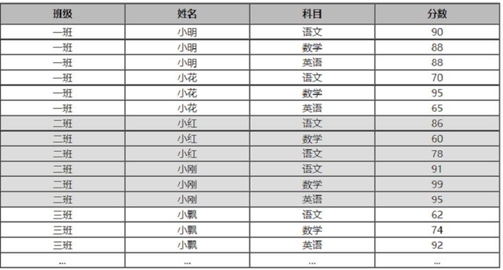

# 前端面试题

## 1、以下布局可以用几种方式实现，请说出你的思路。

## 2、以下两段代码，其输出结果是多少？

### answer: 
1. setTimeout为异步代码，不会立刻执行。每次调用都会存放在回调队列中，等待同步代码执行完毕后执行。这里的0秒表示在执行完同步代码后，在0秒后尽快执行。
2. 使用var定义的变量不会自动生成局部作用域。导致每次循环时都会生成的var i都会覆盖之前的i，当同步代码执行结束后，i的值已经被覆盖成了3。所以此时打印的结果都是3。
3. 反之，let每次都会生成局部作用域，每次for循环的i都互不干扰，所以console出来的还是原本的i的值。

## 3、(填空题) 一天夜里，A, B，C，D四人过桥，只有一只手电筒，桥內一次允许2人同时行走（必须手持手电筒），已知：过桥时间分别为：A：1 min      B：2min     C：5 min    D：10min

AB 2min
A 1min
CD 10min
B 2min
AB 2min

问：四人到达对岸，最少花费17min

## 4、请实现1×2×3×…×n (n的阶乘)的计算。

## 5、已知

以及该部分的代码结构如下： 

请用JS算出:
- 每个班级三科总分
- 每个人的三科总分
- 全年级的单科总分(语文、数学、英语)